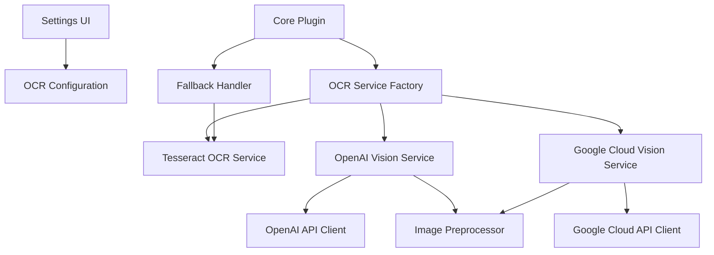
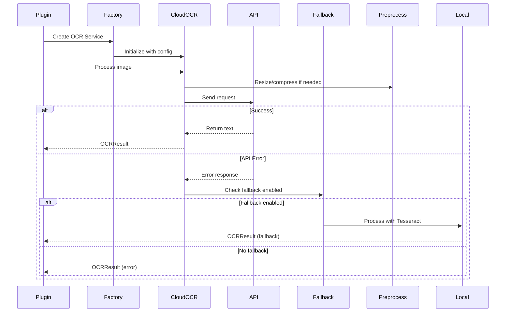

# Design Document

## Overview

The Cloud OCR Integration feature extends the Notebook OCR Plugin to support cloud-based OCR services as alternatives to the local Tesseract.js engine. This design implements support for two major cloud OCR providers: OpenAI Vision API (GPT-4o with vision capabilities) and Google Cloud Vision API. Cloud providers offer significantly better accuracy for handwritten text, particularly cursive and messy handwriting, at the cost of requiring internet connectivity, API credentials, and per-request costs.

## Architecture

### High-Level Architecture



### Component Interaction Flow



## Components and Interfaces


### 1. Extended OCR Service Interface

```typescript
interface OCRService {
    initialize(): Promise<void>;
    processImage(imageData: ArrayBuffer): Promise<OCRResult>;
    isAvailable(): boolean;
    testConnection?(): Promise<ConnectionTestResult>;
    getProviderInfo?(): OCRProviderInfo;
}

interface OCRResult {
    text: string;
    confidence: number;
    error?: string;
    provider?: string;  // NEW: Track which provider was used
    fallbackUsed?: boolean;  // NEW: Indicate if fallback was triggered
}

interface ConnectionTestResult {
    success: boolean;
    responseTime?: number;
    error?: string;
}

interface OCRProviderInfo {
    name: string;
    requiresApiKey: boolean;
    requiresInternet: boolean;
    estimatedCost: string;
    pricingUrl: string;
    accuracyRating: 'low' | 'medium' | 'high' | 'very-high';
}
```

### 2. OpenAI Vision OCR Service

```typescript
class OpenAIVisionService implements OCRService {
    private apiKey: string;
    private apiEndpoint: string;
    private model: string = 'gpt-4o';
    private maxTokens: number = 1000;

    constructor(config: OpenAIConfig) {
        this.apiKey = config.apiKey;
        this.apiEndpoint = config.customEndpoint || 'https://api.openai.com/v1';
    }

    async initialize(): Promise<void> {
        // Validate API key format
        if (!this.apiKey || !this.apiKey.startsWith('sk-')) {
            throw new Error('Invalid OpenAI API key format');
        }
    }

    async processImage(imageData: ArrayBuffer): Promise<OCRResult> {
        try {
            // Convert image to base64
            const base64Image = this.arrayBufferToBase64(imageData);

            // Construct request payload
            const payload = {
                model: this.model,
                messages: [
                    {
                        role: 'user',
                        content: [
                            {
                                type: 'text',
                                text: 'Extract all text from this image. Return only the text content, preserving line breaks and formatting as much as possible.'
                            },
                            {
                                type: 'image_url',
                                image_url: {
                                    url: `data:image/jpeg;base64,${base64Image}`
                                }
                            }
                        ]
                    }
                ],
                max_tokens: this.maxTokens
            };

            // Send request
            const response = await this.sendRequest(payload);

            // Parse response
            const text = response.choices[0]?.message?.content || '';

            return {
                text: text.trim(),
                confidence: 0.95,  // OpenAI doesn't provide confidence scores
                provider: 'OpenAI Vision',
                fallbackUsed: false
            };
        } catch (error) {
            return {
                text: '',
                confidence: 0,
                error: this.formatError(error),
                provider: 'OpenAI Vision'
            };
        }
    }

    async testConnection(): Promise<ConnectionTestResult> {
        const startTime = Date.now();
        try {
            // Send a minimal test request with a small test image
            const testImage = this.createTestImage();
            const result = await this.processImage(testImage);

            if (result.error) {
                return {
                    success: false,
                    error: result.error
                };
            }

            return {
                success: true,
                responseTime: Date.now() - startTime
            };
        } catch (error) {
            return {
                success: false,
                error: this.formatError(error)
            };
        }
    }

    getProviderInfo(): OCRProviderInfo {
        return {
            name: 'OpenAI Vision (GPT-4o)',
            requiresApiKey: true,
            requiresInternet: true,
            estimatedCost: '$0.00265 per image (1024x1024)',
            pricingUrl: 'https://openai.com/api/pricing/',
            accuracyRating: 'very-high'
        };
    }

    private async sendRequest(payload: any): Promise<any> {
        const response = await fetch(`${this.apiEndpoint}/chat/completions`, {
            method: 'POST',
            headers: {
                'Content-Type': 'application/json',
                'Authorization': `Bearer ${this.apiKey}`
            },
            body: JSON.stringify(payload)
        });

        if (!response.ok) {
            const errorData = await response.json();
            throw new Error(errorData.error?.message || `HTTP ${response.status}`);
        }

        return await response.json();
    }

    private formatError(error: any): string {
        if (error.message?.includes('401') || error.message?.includes('authentication')) {
            return 'Invalid API key. Please check your OpenAI API key in settings.';
        }
        if (error.message?.includes('429') || error.message?.includes('rate limit')) {
            return 'Rate limit exceeded. Please wait before trying again.';
        }
        if (error.message?.includes('network') || error.message?.includes('fetch')) {
            return 'Network error. Please check your internet connection.';
        }
        return `OpenAI API error: ${error.message}`;
    }

    private arrayBufferToBase64(buffer: ArrayBuffer): string {
        const bytes = new Uint8Array(buffer);
        let binary = '';
        for (let i = 0; i < bytes.byteLength; i++) {
            binary += String.fromCharCode(bytes[i]);
        }
        return btoa(binary);
    }

    private createTestImage(): ArrayBuffer {
        // Create a minimal 1x1 pixel test image
        // This is a base64-encoded 1x1 transparent PNG
        const testBase64 = 'iVBORw0KGgoAAAANSUhEUgAAAAEAAAABCAYAAAAfFcSJAAAADUlEQVR42mNk+M9QDwADhgGAWjR9awAAAABJRU5ErkJggg==';
        const binary = atob(testBase64);
        const bytes = new Uint8Array(binary.length);
        for (let i = 0; i < binary.length; i++) {
            bytes[i] = binary.charCodeAt(i);
        }
        return bytes.buffer;
    }

    isAvailable(): boolean {
        return !!this.apiKey;
    }
}
```

### 3. Google Cloud Vision OCR Service

```typescript
class GoogleCloudVisionService implements OCRService {
    private apiKey: string;
    private projectId?: string;
    private apiEndpoint: string = 'https://vision.googleapis.com/v1';

    constructor(config: GoogleCloudConfig) {
        this.apiKey = config.apiKey;
        this.projectId = config.projectId;
    }

    async initialize(): Promise<void> {
        if (!this.apiKey) {
            throw new Error('Google Cloud Vision API key is required');
        }
    }

    async processImage(imageData: ArrayBuffer): Promise<OCRResult> {
        try {
            // Convert image to base64
            const base64Image = this.arrayBufferToBase64(imageData);

            // Construct request payload
            const payload = {
                requests: [
                    {
                        image: {
                            content: base64Image
                        },
                        features: [
                            {
                                type: 'TEXT_DETECTION',
                                maxResults: 1
                            }
                        ]
                    }
                ]
            };

            // Send request
            const response = await this.sendRequest(payload);

            // Parse response
            const textAnnotations = response.responses[0]?.textAnnotations;
            if (!textAnnotations || textAnnotations.length === 0) {
                return {
                    text: '',
                    confidence: 0,
                    provider: 'Google Cloud Vision'
                };
            }

            // First annotation contains the full text
            const fullText = textAnnotations[0].description;
            const confidence = textAnnotations[0].confidence || 0.9;

            return {
                text: fullText.trim(),
                confidence: confidence,
                provider: 'Google Cloud Vision',
                fallbackUsed: false
            };
        } catch (error) {
            return {
                text: '',
                confidence: 0,
                error: this.formatError(error),
                provider: 'Google Cloud Vision'
            };
        }
    }

    async testConnection(): Promise<ConnectionTestResult> {
        const startTime = Date.now();
        try {
            const testImage = this.createTestImage();
            const result = await this.processImage(testImage);

            if (result.error) {
                return {
                    success: false,
                    error: result.error
                };
            }

            return {
                success: true,
                responseTime: Date.now() - startTime
            };
        } catch (error) {
            return {
                success: false,
                error: this.formatError(error)
            };
        }
    }

    getProviderInfo(): OCRProviderInfo {
        return {
            name: 'Google Cloud Vision',
            requiresApiKey: true,
            requiresInternet: true,
            estimatedCost: '$1.50 per 1000 images (first 1000 free/month)',
            pricingUrl: 'https://cloud.google.com/vision/pricing',
            accuracyRating: 'very-high'
        };
    }

    private async sendRequest(payload: any): Promise<any> {
        const url = `${this.apiEndpoint}/images:annotate?key=${this.apiKey}`;

        const response = await fetch(url, {
            method: 'POST',
            headers: {
                'Content-Type': 'application/json'
            },
            body: JSON.stringify(payload)
        });

        if (!response.ok) {
            const errorData = await response.json();
            throw new Error(errorData.error?.message || `HTTP ${response.status}`);
        }

        return await response.json();
    }

    private formatError(error: any): string {
        if (error.message?.includes('401') || error.message?.includes('403') || error.message?.includes('API key')) {
            return 'Invalid API key. Please check your Google Cloud Vision API key in settings.';
        }
        if (error.message?.includes('429') || error.message?.includes('quota')) {
            return 'Quota exceeded. Please check your Google Cloud quota limits.';
        }
        if (error.message?.includes('network') || error.message?.includes('fetch')) {
            return 'Network error. Please check your internet connection.';
        }
        return `Google Cloud Vision error: ${error.message}`;
    }

    private arrayBufferToBase64(buffer: ArrayBuffer): string {
        const bytes = new Uint8Array(buffer);
        let binary = '';
        for (let i = 0; i < bytes.byteLength; i++) {
            binary += String.fromCharCode(bytes[i]);
        }
        return btoa(binary);
    }

    private createTestImage(): ArrayBuffer {
        const testBase64 = 'iVBORw0KGgoAAAANSUhEUgAAAAEAAAABCAYAAAAfFcSJAAAADUlEQVR42mNk+M9QDwADhgGAWjR9awAAAABJRU5ErkJggg==';
        const binary = atob(testBase64);
        const bytes = new Uint8Array(binary.length);
        for (let i = 0; i < binary.length; i++) {
            bytes[i] = binary.charCodeAt(i);
        }
        return bytes.buffer;
    }

    isAvailable(): boolean {
        return !!this.apiKey;
    }
}
```


### 4. OCR Service Factory (Updated)

```typescript
class OCRServiceFactory {
    static create(settings: PluginSettings): OCRService {
        const backend = settings.ocrBackend;

        switch (backend) {
            case 'openai':
                if (!settings.openaiApiKey) {
                    throw new Error('OpenAI API key is required');
                }
                return new OpenAIVisionService({
                    apiKey: settings.openaiApiKey,
                    customEndpoint: settings.openaiCustomEndpoint
                });

            case 'google':
                if (!settings.googleCloudApiKey) {
                    throw new Error('Google Cloud Vision API key is required');
                }
                return new GoogleCloudVisionService({
                    apiKey: settings.googleCloudApiKey,
                    projectId: settings.googleCloudProjectId
                });

            case 'tesseract':
            default:
                return new TesseractOCRService();
        }
    }
}
```

### 5. Fallback Handler

```typescript
class OCRFallbackHandler {
    private primaryService: OCRService;
    private fallbackService: OCRService;
    private fallbackEnabled: boolean;

    constructor(
        primaryService: OCRService,
        fallbackService: OCRService,
        fallbackEnabled: boolean
    ) {
        this.primaryService = primaryService;
        this.fallbackService = fallbackService;
        this.fallbackEnabled = fallbackEnabled;
    }

    async processImage(imageData: ArrayBuffer): Promise<OCRResult> {
        // Try primary service first
        const primaryResult = await this.primaryService.processImage(imageData);

        // If successful, return result
        if (!primaryResult.error) {
            return primaryResult;
        }

        // If fallback is disabled, return error result
        if (!this.fallbackEnabled) {
            return primaryResult;
        }

        // Try fallback service
        console.log(`Primary OCR failed: ${primaryResult.error}. Attempting fallback...`);
        const fallbackResult = await this.fallbackService.processImage(imageData);

        // Mark that fallback was used
        fallbackResult.fallbackUsed = true;

        return fallbackResult;
    }
}
```

### 6. Image Preprocessor

```typescript
class ImagePreprocessor {
    private maxDimension: number;
    private maxFileSize: number;  // in bytes

    constructor(maxDimension: number = 2048, maxFileSize: number = 4 * 1024 * 1024) {
        this.maxDimension = maxDimension;
        this.maxFileSize = maxFileSize;
    }

    async preprocess(imageData: ArrayBuffer): Promise<ArrayBuffer> {
        // Check if preprocessing is needed
        if (imageData.byteLength <= this.maxFileSize) {
            const dimensions = await this.getImageDimensions(imageData);
            if (dimensions.width <= this.maxDimension && dimensions.height <= this.maxDimension) {
                return imageData;  // No preprocessing needed
            }
        }

        // Load image
        const img = await this.loadImage(imageData);

        // Calculate new dimensions
        const scale = Math.min(
            this.maxDimension / img.width,
            this.maxDimension / img.height,
            1  // Don't upscale
        );

        const newWidth = Math.floor(img.width * scale);
        const newHeight = Math.floor(img.height * scale);

        // Resize image
        const resized = await this.resizeImage(img, newWidth, newHeight);

        // Compress if still too large
        let quality = 0.9;
        let compressed = await this.compressImage(resized, quality);

        while (compressed.byteLength > this.maxFileSize && quality > 0.5) {
            quality -= 0.1;
            compressed = await this.compressImage(resized, quality);
        }

        return compressed;
    }

    private async loadImage(imageData: ArrayBuffer): Promise<HTMLImageElement> {
        return new Promise((resolve, reject) => {
            const blob = new Blob([imageData]);
            const url = URL.createObjectURL(blob);
            const img = new Image();

            img.onload = () => {
                URL.revokeObjectURL(url);
                resolve(img);
            };

            img.onerror = () => {
                URL.revokeObjectURL(url);
                reject(new Error('Failed to load image'));
            };

            img.src = url;
        });
    }

    private async resizeImage(
        img: HTMLImageElement,
        width: number,
        height: number
    ): Promise<HTMLCanvasElement> {
        const canvas = document.createElement('canvas');
        canvas.width = width;
        canvas.height = height;

        const ctx = canvas.getContext('2d');
        if (!ctx) {
            throw new Error('Failed to get canvas context');
        }

        ctx.drawImage(img, 0, 0, width, height);
        return canvas;
    }

    private async compressImage(
        canvas: HTMLCanvasElement,
        quality: number
    ): Promise<ArrayBuffer> {
        return new Promise((resolve, reject) => {
            canvas.toBlob(
                (blob) => {
                    if (!blob) {
                        reject(new Error('Failed to compress image'));
                        return;
                    }

                    const reader = new FileReader();
                    reader.onload = () => {
                        resolve(reader.result as ArrayBuffer);
                    };
                    reader.onerror = () => {
                        reject(new Error('Failed to read compressed image'));
                    };
                    reader.readAsArrayBuffer(blob);
                },
                'image/jpeg',
                quality
            );
        });
    }

    private async getImageDimensions(imageData: ArrayBuffer): Promise<{width: number, height: number}> {
        const img = await this.loadImage(imageData);
        return { width: img.width, height: img.height };
    }
}
```

## Data Models

### Extended Settings Interface

```typescript
interface PluginSettings {
    // Existing settings...

    // OCR Backend Selection
    ocrBackend: 'tesseract' | 'openai' | 'google';

    // OpenAI Configuration
    openaiApiKey?: string;
    openaiCustomEndpoint?: string;

    // Google Cloud Configuration
    googleCloudApiKey?: string;
    googleCloudProjectId?: string;

    // Fallback Configuration
    enableOcrFallback: boolean;

    // Image Preprocessing
    enableImagePreprocessing: boolean;
    maxImageDimension: number;
    maxImageFileSize: number;  // in MB

    // Metadata
    includeOcrProviderMetadata: boolean;
}

const DEFAULT_SETTINGS: PluginSettings = {
    // Existing defaults...

    ocrBackend: 'tesseract',
    enableOcrFallback: true,
    enableImagePreprocessing: true,
    maxImageDimension: 2048,
    maxImageFileSize: 4,
    includeOcrProviderMetadata: false
};
```

### Configuration Interfaces

```typescript
interface OpenAIConfig {
    apiKey: string;
    customEndpoint?: string;
}

interface GoogleCloudConfig {
    apiKey: string;
    projectId?: string;
}
```

## Error Handling

### Error Types and Messages

```typescript
enum OCRErrorType {
    AUTHENTICATION = 'authentication',
    RATE_LIMIT = 'rate_limit',
    NETWORK = 'network',
    INVALID_IMAGE = 'invalid_image',
    QUOTA_EXCEEDED = 'quota_exceeded',
    UNKNOWN = 'unknown'
}

class OCRError extends Error {
    type: OCRErrorType;
    provider: string;
    originalError?: any;

    constructor(type: OCRErrorType, provider: string, message: string, originalError?: any) {
        super(message);
        this.type = type;
        this.provider = provider;
        this.originalError = originalError;
    }
}
```

### User-Friendly Error Messages

```typescript
class ErrorMessageFormatter {
    static format(error: OCRError): string {
        const baseMessage = `${error.provider} OCR failed: `;

        switch (error.type) {
            case OCRErrorType.AUTHENTICATION:
                return baseMessage + 'Invalid API key. Please check your API key in settings.';

            case OCRErrorType.RATE_LIMIT:
                return baseMessage + 'Rate limit exceeded. Please wait before trying again or upgrade your plan.';

            case OCRErrorType.NETWORK:
                return baseMessage + 'Network error. Please check your internet connection.';

            case OCRErrorType.QUOTA_EXCEEDED:
                return baseMessage + 'API quota exceeded. Please check your usage limits.';

            case OCRErrorType.INVALID_IMAGE:
                return baseMessage + 'Invalid image format or corrupted image file.';

            default:
                return baseMessage + error.message;
        }
    }
}
```

## Testing Strategy

### Unit Tests

- **OpenAI Vision Service**: Mock API responses, test error handling, test base64 encoding
- **Google Cloud Vision Service**: Mock API responses, test error handling, test response parsing
- **Fallback Handler**: Test fallback triggering, test fallback disabled behavior
- **Image Preprocessor**: Test resizing logic, test compression, test dimension calculations

### Integration Tests

- **End-to-End Cloud OCR**: Test with real API keys (in CI/CD with secrets)
- **Fallback Flow**: Test primary failure → fallback success
- **Settings Persistence**: Test API key storage and retrieval

### Manual Testing

- **API Key Validation**: Test with invalid keys, expired keys
- **Connection Testing**: Test connection test button for each provider
- **Cost Awareness**: Verify cost information is displayed correctly
- **Error Messages**: Verify user-friendly error messages for all error types


## Settings UI Design

### OCR Backend Selection Section

```typescript
class CloudOCRSettingsUI {
    display(containerEl: HTMLElement, plugin: NotebookOCRPlugin) {
        // Backend Selection
        new Setting(containerEl)
            .setName('OCR Backend')
            .setDesc('Choose the OCR engine for text extraction')
            .addDropdown(dropdown => dropdown
                .addOption('tesseract', 'Local (Tesseract.js) - Free, offline, good for printed text')
                .addOption('openai', 'OpenAI Vision - Best for handwriting, requires API key')
                .addOption('google', 'Google Cloud Vision - Excellent accuracy, requires API key')
                .setValue(plugin.settings.ocrBackend)
                .onChange(async (value) => {
                    plugin.settings.ocrBackend = value as any;
                    await plugin.saveSettings();
                    this.display(containerEl, plugin);  // Refresh to show/hide API key fields
                }));

        // OpenAI Configuration (shown only when OpenAI is selected)
        if (plugin.settings.ocrBackend === 'openai') {
            this.displayOpenAISettings(containerEl, plugin);
        }

        // Google Cloud Configuration (shown only when Google is selected)
        if (plugin.settings.ocrBackend === 'google') {
            this.displayGoogleCloudSettings(containerEl, plugin);
        }

        // Fallback Configuration (shown only for cloud backends)
        if (plugin.settings.ocrBackend !== 'tesseract') {
            this.displayFallbackSettings(containerEl, plugin);
        }

        // Image Preprocessing (shown only for cloud backends)
        if (plugin.settings.ocrBackend !== 'tesseract') {
            this.displayPreprocessingSettings(containerEl, plugin);
        }

        // Metadata Settings
        this.displayMetadataSettings(containerEl, plugin);
    }

    private displayOpenAISettings(containerEl: HTMLElement, plugin: NotebookOCRPlugin) {
        // Cost Warning
        const warningEl = containerEl.createDiv('setting-item-description');
        warningEl.style.color = 'var(--text-warning)';
        warningEl.style.marginBottom = '1em';
        warningEl.innerHTML = '⚠️ OpenAI Vision API usage incurs costs (~$0.00265 per image). ' +
            '<a href="https://openai.com/api/pricing/">View pricing</a>';

        // API Key
        new Setting(containerEl)
            .setName('OpenAI API Key')
            .setDesc('Your OpenAI API key (starts with sk-)')
            .addText(text => text
                .setPlaceholder('sk-...')
                .setValue(plugin.settings.openaiApiKey || '')
                .onChange(async (value) => {
                    plugin.settings.openaiApiKey = value;
                    await plugin.saveSettings();
                }))
            .addButton(button => button
                .setButtonText('Test Connection')
                .onClick(async () => {
                    await this.testOpenAIConnection(plugin);
                }));

        // Custom Endpoint (Advanced)
        new Setting(containerEl)
            .setName('Custom API Endpoint')
            .setDesc('Optional: Use a custom OpenAI-compatible endpoint')
            .addText(text => text
                .setPlaceholder('https://api.openai.com/v1')
                .setValue(plugin.settings.openaiCustomEndpoint || '')
                .onChange(async (value) => {
                    plugin.settings.openaiCustomEndpoint = value;
                    await plugin.saveSettings();
                }));
    }

    private displayGoogleCloudSettings(containerEl: HTMLElement, plugin: NotebookOCRPlugin) {
        // Cost Info
        const infoEl = containerEl.createDiv('setting-item-description');
        infoEl.style.marginBottom = '1em';
        infoEl.innerHTML = 'ℹ️ Google Cloud Vision: First 1000 images/month free, then $1.50 per 1000. ' +
            '<a href="https://cloud.google.com/vision/pricing">View pricing</a>';

        // API Key
        new Setting(containerEl)
            .setName('Google Cloud API Key')
            .setDesc('Your Google Cloud Vision API key')
            .addText(text => text
                .setPlaceholder('AIza...')
                .setValue(plugin.settings.googleCloudApiKey || '')
                .onChange(async (value) => {
                    plugin.settings.googleCloudApiKey = value;
                    await plugin.saveSettings();
                }))
            .addButton(button => button
                .setButtonText('Test Connection')
                .onClick(async () => {
                    await this.testGoogleCloudConnection(plugin);
                }));

        // Project ID (Optional)
        new Setting(containerEl)
            .setName('Project ID')
            .setDesc('Optional: Your Google Cloud project ID')
            .addText(text => text
                .setPlaceholder('my-project-123')
                .setValue(plugin.settings.googleCloudProjectId || '')
                .onChange(async (value) => {
                    plugin.settings.googleCloudProjectId = value;
                    await plugin.saveSettings();
                }));
    }

    private displayFallbackSettings(containerEl: HTMLElement, plugin: NotebookOCRPlugin) {
        new Setting(containerEl)
            .setName('Enable Fallback to Local OCR')
            .setDesc('Automatically use Tesseract if cloud OCR fails')
            .addToggle(toggle => toggle
                .setValue(plugin.settings.enableOcrFallback)
                .onChange(async (value) => {
                    plugin.settings.enableOcrFallback = value;
                    await plugin.saveSettings();
                }));
    }

    private displayPreprocessingSettings(containerEl: HTMLElement, plugin: NotebookOCRPlugin) {
        new Setting(containerEl)
            .setName('Enable Image Preprocessing')
            .setDesc('Automatically resize and compress large images before sending to cloud API')
            .addToggle(toggle => toggle
                .setValue(plugin.settings.enableImagePreprocessing)
                .onChange(async (value) => {
                    plugin.settings.enableImagePreprocessing = value;
                    await plugin.saveSettings();
                }));

        if (plugin.settings.enableImagePreprocessing) {
            new Setting(containerEl)
                .setName('Maximum Image Dimension')
                .setDesc('Images larger than this will be resized (pixels)')
                .addText(text => text
                    .setPlaceholder('2048')
                    .setValue(String(plugin.settings.maxImageDimension))
                    .onChange(async (value) => {
                        const num = parseInt(value);
                        if (!isNaN(num) && num > 0) {
                            plugin.settings.maxImageDimension = num;
                            await plugin.saveSettings();
                        }
                    }));

            new Setting(containerEl)
                .setName('Maximum File Size')
                .setDesc('Maximum file size to send to API (MB)')
                .addText(text => text
                    .setPlaceholder('4')
                    .setValue(String(plugin.settings.maxImageFileSize))
                    .onChange(async (value) => {
                        const num = parseInt(value);
                        if (!isNaN(num) && num > 0) {
                            plugin.settings.maxImageFileSize = num;
                            await plugin.saveSettings();
                        }
                    }));
        }
    }

    private displayMetadataSettings(containerEl: HTMLElement, plugin: NotebookOCRPlugin) {
        new Setting(containerEl)
            .setName('Include OCR Provider in Notes')
            .setDesc('Add frontmatter indicating which OCR backend was used')
            .addToggle(toggle => toggle
                .setValue(plugin.settings.includeOcrProviderMetadata)
                .onChange(async (value) => {
                    plugin.settings.includeOcrProviderMetadata = value;
                    await plugin.saveSettings();
                }));
    }

    private async testOpenAIConnection(plugin: NotebookOCRPlugin) {
        const notice = new Notice('Testing OpenAI connection...', 0);

        try {
            const service = new OpenAIVisionService({
                apiKey: plugin.settings.openaiApiKey || '',
                customEndpoint: plugin.settings.openaiCustomEndpoint
            });

            const result = await service.testConnection();

            notice.hide();

            if (result.success) {
                new Notice(`✓ Connection successful! Response time: ${result.responseTime}ms`);
            } else {
                new Notice(`✗ Connection failed: ${result.error}`, 5000);
            }
        } catch (error) {
            notice.hide();
            new Notice(`✗ Connection test failed: ${error.message}`, 5000);
        }
    }

    private async testGoogleCloudConnection(plugin: NotebookOCRPlugin) {
        const notice = new Notice('Testing Google Cloud Vision connection...', 0);

        try {
            const service = new GoogleCloudVisionService({
                apiKey: plugin.settings.googleCloudApiKey || '',
                projectId: plugin.settings.googleCloudProjectId
            });

            const result = await service.testConnection();

            notice.hide();

            if (result.success) {
                new Notice(`✓ Connection successful! Response time: ${result.responseTime}ms`);
            } else {
                new Notice(`✗ Connection failed: ${result.error}`, 5000);
            }
        } catch (error) {
            notice.hide();
            new Notice(`✗ Connection test failed: ${error.message}`, 5000);
        }
    }
}
```

## Performance Optimization

### Request Optimization

- **Image Preprocessing**: Resize and compress images before sending to reduce bandwidth and costs
- **Caching**: Cache OCR results to avoid reprocessing the same image
- **Batch Processing**: Process multiple images in parallel (with rate limiting)

### Cost Optimization

- **Preprocessing**: Reduce image size to minimize API costs
- **Fallback Strategy**: Use free local OCR when possible, cloud only when needed
- **Usage Tracking**: Log API usage to help users monitor costs

## Security and Privacy

### API Key Storage

- Store API keys in Obsidian's secure data storage
- Never log or display full API keys
- Mask API keys in UI (show only first/last few characters)

### Data Transmission

- All API requests use HTTPS
- Images are sent directly to cloud providers (no intermediary servers)
- No data is stored by the plugin after processing

### Privacy Considerations

- Warn users that cloud OCR sends images to external services
- Provide clear information about data handling by each provider
- Offer local-only option (Tesseract) for privacy-sensitive use cases

## Dependencies

### NPM Packages

No additional dependencies required - uses native `fetch` API for HTTP requests.

### Optional Dependencies

For future enhancements:
- `openai` package (official SDK) - for more advanced features
- `@google-cloud/vision` package (official SDK) - for service account authentication

## Migration Strategy

### Backward Compatibility

- Existing Tesseract-based installations continue to work without changes
- Cloud OCR is opt-in via settings
- Default backend remains Tesseract

### Settings Migration

```typescript
async function migrateSettings(oldSettings: any): Promise<PluginSettings> {
    const newSettings = { ...DEFAULT_SETTINGS, ...oldSettings };

    // Migrate old 'cloudApiKey' to provider-specific keys
    if (oldSettings.cloudApiKey && oldSettings.cloudApiProvider === 'openai') {
        newSettings.openaiApiKey = oldSettings.cloudApiKey;
    }

    return newSettings;
}
```

## Future Enhancements

### Potential Features

- **Azure Computer Vision**: Add Microsoft Azure as a third cloud provider
- **Batch Processing UI**: Show progress for multiple images
- **Cost Tracking**: Track and display estimated API costs
- **Quality Comparison**: Side-by-side comparison of different OCR backends
- **Custom Prompts**: Allow users to customize the OpenAI prompt for specific use cases
- **Language Selection**: Specify language hints for better accuracy
- **Confidence Thresholds**: Automatically retry with different backend if confidence is low
