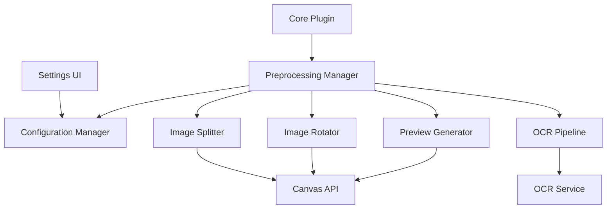
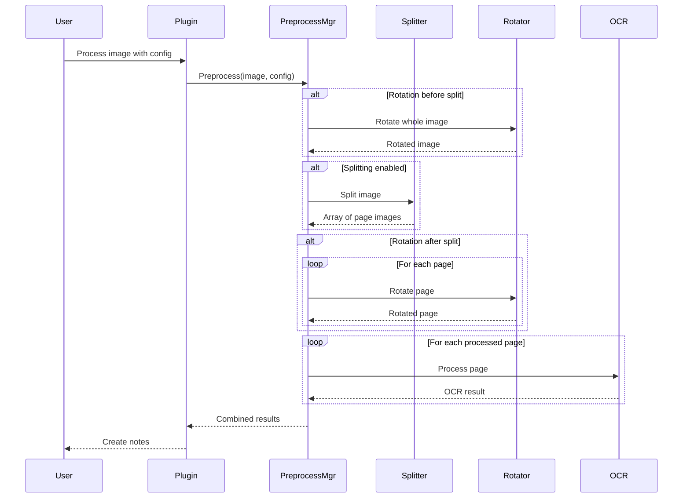

# Design Document

## Overview

The Notebook Image Preprocessing feature provides automatic image splitting and rotation capabilities to handle multi-page notebook scans. Users often scan multiple notebook pages in a single image (e.g., two pocket notebook pages side-by-side, A5 notebooks that need rotation), which causes OCR engines to read text across both pages instead of treating each page separately. This feature solves that problem by preprocessing images before OCR, splitting them into individual pages and applying necessary rotations.

The design includes predefined presets for common notebook formats (single-page 8.5x11, pocket notebooks side-by-side, A5 notebooks), custom configuration options for non-standard formats, a preview system to verify transformations, and integration with the existing OCR pipeline to ensure each page is processed correctly.

## Architecture

### High-Level Architecture



### Component Interaction Flow



## Components and Interfaces

### 1. Preprocessing Configuration

```typescript
/**
 * Notebook type preset enumeration
 */
enum NotebookPreset {
    SINGLE_PAGE = 'single-page',
    POCKET_SIDE_BY_SIDE = 'pocket-side-by-side',
    A5_PORTRAIT = 'a5-portrait',
    A5_LANDSCAPE = 'a5-landscape',
    CUSTOM = 'custom'
}

/**
 * Split direction enumeration
 */
enum SplitDirection {
    HORIZONTAL = 'horizontal',
    VERTICAL = 'vertical'
}

/**
 * Rotation angle enumeration
 */
enum RotationAngle {
    NONE = 0,
    CLOCKWISE_90 = 90,
    CLOCKWISE_180 = 180,
    CLOCKWISE_270 = 270
}

/**
 * Rotation timing enumeration
 */
enum RotationTiming {
    BEFORE_SPLIT = 'before-split',
    AFTER_SPLIT = 'after-split'
}

/**
 * Split configuration interface
 */
interface SplitConfig {
    enabled: boolean;
    direction: SplitDirection;
    pageCount: number;  // 2, 3, or 4
}

/**
 * Rotation configuration interface
 */
interface RotationConfig {
    enabled: boolean;
    timing: RotationTiming;
    wholeImageAngle?: RotationAngle;  // Used when timing is BEFORE_SPLIT
    perPageAngles?: RotationAngle[];  // Used when timing is AFTER_SPLIT
}

/**
 * Preprocessing configuration interface
 */
interface PreprocessingConfig {
    id: string;
    name: string;
    description: string;
    preset: NotebookPreset;
    split: SplitConfig;
    rotation: RotationConfig;
}

/**
 * Predefined preset configurations
 */
const PRESET_CONFIGS: Record<NotebookPreset, PreprocessingConfig> = {
    [NotebookPreset.SINGLE_PAGE]: {
        id: 'preset-single-page',
        name: 'Single Page (8.5x11)',
        description: 'Standard single-page notebook scan, no splitting needed',
        preset: NotebookPreset.SINGLE_PAGE,
        split: {
            enabled: false,
            direction: SplitDirection.HORIZONTAL,
            pageCount: 1
        },
        rotation: {
            enabled: false,
            timing: RotationTiming.BEFORE_SPLIT
        }
    },
    [NotebookPreset.POCKET_SIDE_BY_SIDE]: {
        id: 'preset-pocket-side-by-side',
        name: 'Pocket Notebooks Side-by-Side (3.5x5.5)',
        description: 'Two pocket notebook pages scanned horizontally side-by-side',
        preset: NotebookPreset.POCKET_SIDE_BY_SIDE,
        split: {
            enabled: true,
            direction: SplitDirection.VERTICAL,
            pageCount: 2
        },
        rotation: {
            enabled: false,
            timing: RotationTiming.AFTER_SPLIT
        }
    },
    [NotebookPreset.A5_PORTRAIT]: {
        id: 'preset-a5-portrait',
        name: 'A5 Portrait',
        description: 'A5 notebook scanned in portrait orientation',
        preset: NotebookPreset.A5_PORTRAIT,
        split: {
            enabled: false,
            direction: SplitDirection.HORIZONTAL,
            pageCount: 1
        },
        rotation: {
            enabled: false,
            timing: RotationTiming.BEFORE_SPLIT
        }
    },
    [NotebookPreset.A5_LANDSCAPE]: {
        id: 'preset-a5-landscape',
        name: 'A5 Landscape (needs rotation)',
        description: 'A5 notebook scanned in landscape, rotated to portrait',
        preset: NotebookPreset.A5_LANDSCAPE,
        split: {
            enabled: false,
            direction: SplitDirection.HORIZONTAL,
            pageCount: 1
        },
        rotation: {
            enabled: true,
            timing: RotationTiming.BEFORE_SPLIT,
            wholeImageAngle: RotationAngle.CLOCKWISE_90
        }
    }
};
```

### 2. Configuration Manager

```typescript
/**
 * Configuration manager for preprocessing settings
 */
class PreprocessingConfigManager {
    private configs: Map<string, PreprocessingConfig>;
    private defaultConfigId: string | null;

    constructor() {
        this.configs = new Map();
        this.defaultConfigId = null;
        this.initializePresets();
    }

    /**
     * Initialize with predefined presets
     */
    private initializePresets(): void {
        Object.values(PRESET_CONFIGS).forEach(config => {
            this.configs.set(config.id, config);
        });
        // Set single-page as default
        this.defaultConfigId = PRESET_CONFIGS[NotebookPreset.SINGLE_PAGE].id;
    }

    /**
     * Get all available configurations
     */
    getAllConfigs(): PreprocessingConfig[] {
        return Array.from(this.configs.values());
    }

    /**
     * Get configuration by ID
     */
    getConfig(id: string): PreprocessingConfig | undefined {
        return this.configs.get(id);
    }

    /**
     * Get default configuration
     */
    getDefaultConfig(): PreprocessingConfig | undefined {
        return this.defaultConfigId ? this.configs.get(this.defaultConfigId) : undefined;
    }

    /**
     * Set default configuration
     */
    setDefaultConfig(id: string): void {
        if (this.configs.has(id)) {
            this.defaultConfigId = id;
        }
    }

    /**
     * Add or update custom configuration
     */
    saveConfig(config: PreprocessingConfig): void {
        this.configs.set(config.id, config);
    }

    /**
     * Delete custom configuration (presets cannot be deleted)
     */
    deleteConfig(id: string): boolean {
        const config = this.configs.get(id);
        if (!config || config.preset !== NotebookPreset.CUSTOM) {
            return false;
        }
        return this.configs.delete(id);
    }

    /**
     * Duplicate configuration as custom
     */
    duplicateConfig(id: string, newName: string): PreprocessingConfig | null {
        const original = this.configs.get(id);
        if (!original) {
            return null;
        }

        const duplicate: PreprocessingConfig = {
            ...original,
            id: `custom-${Date.now()}`,
            name: newName,
            preset: NotebookPreset.CUSTOM
        };

        this.saveConfig(duplicate);
        return duplicate;
    }

    /**
     * Validate configuration
     */
    validateConfig(config: PreprocessingConfig): string[] {
        const errors: string[] = [];

        if (config.split.enabled) {
            if (config.split.pageCount < 2 || config.split.pageCount > 4) {
                errors.push('Page count must be between 2 and 4');
            }
        }

        if (config.rotation.enabled) {
            if (config.rotation.timing === RotationTiming.AFTER_SPLIT && config.rotation.perPageAngles) {
                if (config.split.enabled && config.rotation.perPageAngles.length !== config.split.pageCount) {
                    errors.push('Per-page rotation angles must match page count');
                }
            }
        }

        return errors;
    }
}
```

### 3. Image Splitter

```typescript
/**
 * Image splitter for dividing multi-page scans
 */
class ImageSplitter {
    /**
     * Split an image into multiple pages
     */
    async split(imageData: ArrayBuffer, config: SplitConfig): Promise<ArrayBuffer[]> {
        if (!config.enabled) {
            return [imageData];
        }

        const img = await this.loadImage(imageData);
        const pages: ArrayBuffer[] = [];

        if (config.direction === SplitDirection.HORIZONTAL) {
            // Split horizontally (top to bottom)
            const pageHeight = Math.floor(img.height / config.pageCount);

            for (let i = 0; i < config.pageCount; i++) {
                const y = i * pageHeight;
                const height = (i === config.pageCount - 1)
                    ? img.height - y  // Last page gets remaining pixels
                    : pageHeight;

                const pageData = await this.extractRegion(img, 0, y, img.width, height);
                pages.push(pageData);
            }
        } else {
            // Split vertically (left to right)
            const pageWidth = Math.floor(img.width / config.pageCount);

            for (let i = 0; i < config.pageCount; i++) {
                const x = i * pageWidth;
                const width = (i === config.pageCount - 1)
                    ? img.width - x  // Last page gets remaining pixels
                    : pageWidth;

                const pageData = await this.extractRegion(img, x, 0, width, img.height);
                pages.push(pageData);
            }
        }

        return pages;
    }

    /**
     * Load image from ArrayBuffer
     */
    private async loadImage(imageData: ArrayBuffer): Promise<HTMLImageElement> {
        return new Promise((resolve, reject) => {
            const blob = new Blob([imageData]);
            const url = URL.createObjectURL(blob);
            const img = new Image();

            img.onload = () => {
                URL.revokeObjectURL(url);
                resolve(img);
            };

            img.onerror = () => {
                URL.revokeObjectURL(url);
                reject(new Error('Failed to load image for splitting'));
            };

            img.src = url;
        });
    }

    /**
     * Extract a region from an image
     */
    private async extractRegion(
        img: HTMLImageElement,
        x: number,
        y: number,
        width: number,
        height: number
    ): Promise<ArrayBuffer> {
        const canvas = document.createElement('canvas');
        canvas.width = width;
        canvas.height = height;

        const ctx = canvas.getContext('2d');
        if (!ctx) {
            throw new Error('Failed to get canvas context');
        }

        // Draw the specified region
        ctx.drawImage(img, x, y, width, height, 0, 0, width, height);

        // Convert to ArrayBuffer
        return new Promise((resolve, reject) => {
            canvas.toBlob((blob) => {
                if (!blob) {
                    reject(new Error('Failed to create blob from canvas'));
                    return;
                }

                const reader = new FileReader();
                reader.onload = () => {
                    resolve(reader.result as ArrayBuffer);
                };
                reader.onerror = () => {
                    reject(new Error('Failed to read blob as ArrayBuffer'));
                };
                reader.readAsArrayBuffer(blob);
            }, 'image/jpeg', 0.95);
        });
    }

    /**
     * Validate that image dimensions are suitable for splitting
     */
    validateDimensions(width: number, height: number, config: SplitConfig): string | null {
        if (!config.enabled) {
            return null;
        }

        const minPageDimension = 100;  // Minimum pixels for a page dimension

        if (config.direction === SplitDirection.HORIZONTAL) {
            const pageHeight = height / config.pageCount;
            if (pageHeight < minPageDimension) {
                return `Image height (${height}px) is too small to split into ${config.pageCount} pages. Each page would be ${pageHeight}px tall.`;
            }
        } else {
            const pageWidth = width / config.pageCount;
            if (pageWidth < minPageDimension) {
                return `Image width (${width}px) is too small to split into ${config.pageCount} pages. Each page would be ${pageWidth}px wide.`;
            }
        }

        return null;
    }
}
```

### 4. Image Rotator

```typescript
/**
 * Image rotator for correcting orientation
 */
class ImageRotator {
    /**
     * Rotate an image by specified angle
     */
    async rotate(imageData: ArrayBuffer, angle: RotationAngle): Promise<ArrayBuffer> {
        if (angle === RotationAngle.NONE) {
            return imageData;
        }

        const img = await this.loadImage(imageData);

        // Calculate new dimensions after rotation
        const { width, height } = this.calculateRotatedDimensions(img.width, img.height, angle);

        const canvas = document.createElement('canvas');
        canvas.width = width;
        canvas.height = height;

        const ctx = canvas.getContext('2d');
        if (!ctx) {
            throw new Error('Failed to get canvas context');
        }

        // Apply rotation transformation
        ctx.translate(width / 2, height / 2);
        ctx.rotate((angle * Math.PI) / 180);
        ctx.drawImage(img, -img.width / 2, -img.height / 2);

        // Convert to ArrayBuffer
        return new Promise((resolve, reject) => {
            canvas.toBlob((blob) => {
                if (!blob) {
                    reject(new Error('Failed to create blob from canvas'));
                    return;
                }

                const reader = new FileReader();
                reader.onload = () => {
                    resolve(reader.result as ArrayBuffer);
                };
                reader.onerror = () => {
                    reject(new Error('Failed to read blob as ArrayBuffer'));
                };
                reader.readAsArrayBuffer(blob);
            }, 'image/jpeg', 0.95);
        });
    }

    /**
     * Calculate dimensions after rotation
     */
    private calculateRotatedDimensions(
        width: number,
        height: number,
        angle: RotationAngle
    ): { width: number; height: number } {
        if (angle === RotationAngle.CLOCKWISE_90 || angle === RotationAngle.CLOCKWISE_270) {
            return { width: height, height: width };
        }
        return { width, height };
    }

    /**
     * Load image from ArrayBuffer
     */
    private async loadImage(imageData: ArrayBuffer): Promise<HTMLImageElement> {
        return new Promise((resolve, reject) => {
            const blob = new Blob([imageData]);
            const url = URL.createObjectURL(blob);
            const img = new Image();

            img.onload = () => {
                URL.revokeObjectURL(url);
                resolve(img);
            };

            img.onerror = () => {
                URL.revokeObjectURL(url);
                reject(new Error('Failed to load image for rotation'));
            };

            img.src = url;
        });
    }
}
```

### 5. Preprocessing Manager

```typescript
/**
 * Result of preprocessing operation
 */
interface PreprocessingResult {
    pages: ArrayBuffer[];
    config: PreprocessingConfig;
    transformations: string[];  // Description of applied transformations
}

/**
 * Main preprocessing manager
 */
class PreprocessingManager {
    private splitter: ImageSplitter;
    private rotator: ImageRotator;
    private configManager: PreprocessingConfigManager;

    constructor(configManager: PreprocessingConfigManager) {
        this.splitter = new ImageSplitter();
        this.rotator = new ImageRotator();
        this.configManager = configManager;
    }

    /**
     * Preprocess an image according to configuration
     */
    async preprocess(
        imageData: ArrayBuffer,
        configId?: string
    ): Promise<PreprocessingResult> {
        // Get configuration
        const config = configId
            ? this.configManager.getConfig(configId)
            : this.configManager.getDefaultConfig();

        if (!config) {
            throw new Error('No preprocessing configuration found');
        }

        // Validate configuration
        const errors = this.configManager.validateConfig(config);
        if (errors.length > 0) {
            throw new Error(`Invalid configuration: ${errors.join(', ')}`);
        }

        const transformations: string[] = [];
        let currentImage = imageData;
        let pages: ArrayBuffer[] = [currentImage];

        // Apply rotation before split if configured
        if (config.rotation.enabled &&
            config.rotation.timing === RotationTiming.BEFORE_SPLIT &&
            config.rotation.wholeImageAngle) {

            currentImage = await this.rotator.rotate(currentImage, config.rotation.wholeImageAngle);
            pages = [currentImage];
            transformations.push(`Rotated whole image ${config.rotation.wholeImageAngle}°`);
        }

        // Apply splitting if configured
        if (config.split.enabled) {
            // Validate dimensions before splitting
            const img = await this.loadImageForValidation(currentImage);
            const dimensionError = this.splitter.validateDimensions(
                img.width,
                img.height,
                config.split
            );

            if (dimensionError) {
                throw new Error(dimensionError);
            }

            pages = await this.splitter.split(currentImage, config.split);
            transformations.push(
                `Split ${config.split.direction} into ${config.split.pageCount} pages`
            );
        }

        // Apply rotation after split if configured
        if (config.rotation.enabled &&
            config.rotation.timing === RotationTiming.AFTER_SPLIT &&
            config.rotation.perPageAngles) {

            const rotatedPages: ArrayBuffer[] = [];

            for (let i = 0; i < pages.length; i++) {
                const angle = config.rotation.perPageAngles[i] || RotationAngle.NONE;
                const rotatedPage = await this.rotator.rotate(pages[i], angle);
                rotatedPages.push(rotatedPage);

                if (angle !== RotationAngle.NONE) {
                    transformations.push(`Rotated page ${i + 1} by ${angle}°`);
                }
            }

            pages = rotatedPages;
        }

        return {
            pages,
            config,
            transformations
        };
    }

    /**
     * Load image for validation purposes
     */
    private async loadImageForValidation(imageData: ArrayBuffer): Promise<HTMLImageElement> {
        return new Promise((resolve, reject) => {
            const blob = new Blob([imageData]);
            const url = URL.createObjectURL(blob);
            const img = new Image();

            img.onload = () => {
                URL.revokeObjectURL(url);
                resolve(img);
            };

            img.onerror = () => {
                URL.revokeObjectURL(url);
                reject(new Error('Failed to load image'));
            };

            img.src = url;
        });
    }
}
```

### 6. Preview Generator

```typescript
/**
 * Preview thumbnail interface
 */
interface PreviewThumbnail {
    pageNumber: number;
    dataUrl: string;
    transformations: string[];
}

/**
 * Preview generator for showing preprocessing results
 */
class PreviewGenerator {
    private maxThumbnailSize: number = 300;  // Max width or height in pixels

    /**
     * Generate preview thumbnails for a preprocessing result
     */
    async generatePreviews(result: PreprocessingResult): Promise<PreviewThumbnail[]> {
        const previews: PreviewThumbnail[] = [];

        for (let i = 0; i < result.pages.length; i++) {
            const thumbnail = await this.createThumbnail(result.pages[i], i + 1);
            previews.push(thumbnail);
        }

        return previews;
    }

    /**
     * Create a thumbnail from a page image
     */
    private async createThumbnail(
        pageData: ArrayBuffer,
        pageNumber: number
    ): Promise<PreviewThumbnail> {
        const img = await this.loadImage(pageData);

        // Calculate thumbnail dimensions
        const scale = Math.min(
            this.maxThumbnailSize / img.width,
            this.maxThumbnailSize / img.height,
            1  // Don't upscale
        );

        const thumbWidth = Math.floor(img.width * scale);
        const thumbHeight = Math.floor(img.height * scale);

        // Create thumbnail canvas
        const canvas = document.createElement('canvas');
        canvas.width = thumbWidth;
        canvas.height = thumbHeight;

        const ctx = canvas.getContext('2d');
        if (!ctx) {
            throw new Error('Failed to get canvas context');
        }

        ctx.drawImage(img, 0, 0, thumbWidth, thumbHeight);

        return {
            pageNumber,
            dataUrl: canvas.toDataURL('image/jpeg', 0.8),
            transformations: []
        };
    }

    /**
     * Load image from ArrayBuffer
     */
    private async loadImage(imageData: ArrayBuffer): Promise<HTMLImageElement> {
        return new Promise((resolve, reject) => {
            const blob = new Blob([imageData]);
            const url = URL.createObjectURL(blob);
            const img = new Image();

            img.onload = () => {
                URL.revokeObjectURL(url);
                resolve(img);
            };

            img.onerror = () => {
                URL.revokeObjectURL(url);
                reject(new Error('Failed to load image for preview'));
            };

            img.src = url;
        });
    }
}
```

## Data Models

### Extended Plugin Settings

```typescript
interface PluginSettings {
    // Existing settings...

    // Preprocessing Settings
    enablePreprocessing: boolean;
    defaultPreprocessingConfigId: string | null;
    customPreprocessingConfigs: PreprocessingConfig[];

    // Note Creation Settings for Split Pages
    splitPageNoteMode: 'separate' | 'combined';
    splitPageSeparator: string;
    includePreprocessingMetadata: boolean;
}

const DEFAULT_SETTINGS: Partial<PluginSettings> = {
    // Existing defaults...

    enablePreprocessing: false,
    defaultPreprocessingConfigId: 'preset-single-page',
    customPreprocessingConfigs: [],
    splitPageNoteMode: 'separate',
    splitPageSeparator: '\n\n---\n\n',
    includePreprocessingMetadata: false
};
```

## Error Handling

### Preprocessing Errors

```typescript
/**
 * Preprocessing error types
 */
enum PreprocessingErrorType {
    INVALID_DIMENSIONS = 'invalid_dimensions',
    SPLIT_FAILED = 'split_failed',
    ROTATION_FAILED = 'rotation_failed',
    INVALID_CONFIG = 'invalid_config',
    IMAGE_LOAD_FAILED = 'image_load_failed'
}

/**
 * Preprocessing error class
 */
class PreprocessingError extends Error {
    type: PreprocessingErrorType;
    configId?: string;

    constructor(type: PreprocessingErrorType, message: string, configId?: string) {
        super(message);
        this.type = type;
        this.configId = configId;
        this.name = 'PreprocessingError';
    }
}

/**
 * Error handler for preprocessing operations
 */
class PreprocessingErrorHandler {
    static handle(error: PreprocessingError, imagePath: string): void {
        console.error(`Preprocessing error for ${imagePath}:`, error);

        let userMessage = `Failed to preprocess image "${imagePath}"`;

        switch (error.type) {
            case PreprocessingErrorType.INVALID_DIMENSIONS:
                userMessage += ': Image dimensions are too small for the selected split configuration. Try a different configuration or process without splitting.';
                break;

            case PreprocessingErrorType.SPLIT_FAILED:
                userMessage += ': Failed to split image. The image may be corrupted or in an unsupported format.';
                break;

            case PreprocessingErrorType.ROTATION_FAILED:
                userMessage += ': Failed to rotate image. Attempting to process without rotation.';
                break;

            case PreprocessingErrorType.INVALID_CONFIG:
                userMessage += `: Invalid configuration - ${error.message}`;
                break;

            case PreprocessingErrorType.IMAGE_LOAD_FAILED:
                userMessage += ': Failed to load image. The file may be corrupted.';
                break;

            default:
                userMessage += `: ${error.message}`;
        }

        new Notice(userMessage, 8000);
    }
}
```


## Correctness Properties

*A property is a characteristic or behavior that should hold true across all valid executions of a system-essentially, a formal statement about what the system should do. Properties serve as the bridge between human-readable specifications and machine-verifiable correctness guarantees.*

### Configuration Management Properties

Property 1: Preset selection applies correct settings
*For any* notebook preset, when a user selects that preset, the applied configuration should match the preset's defined split and rotation settings
**Validates: Requirements 1.4**

Property 2: Page count validation
*For any* page count value, validation should succeed if and only if the value is between 2 and 4 (inclusive)
**Validates: Requirements 2.4**

Property 3: Configuration persistence round-trip
*For any* custom preprocessing configuration, saving it and then retrieving it should return an equivalent configuration with the same settings
**Validates: Requirements 2.5, 3.5**

Property 4: Default configuration retrieval
*For any* configuration set as default, retrieving the default configuration should return that same configuration
**Validates: Requirements 6.3**

Property 5: Custom configuration deletion
*For any* custom configuration (non-preset), deleting it should remove it from the saved configurations, and for any preset configuration, deletion should fail
**Validates: Requirements 6.4**

Property 6: Configuration duplication creates independent copy
*For any* configuration, duplicating it should create a new configuration with the same settings but a different ID, and modifying the duplicate should not affect the original
**Validates: Requirements 6.5**


### Image Processing Properties

Property 7: Preview does not trigger OCR
*For any* image, generating a preview should not result in any calls to the OCR engine
**Validates: Requirements 4.5**

Property 8: Split before OCR ordering
*For any* image with split enabled, the split transformation should be applied before any OCR processing occurs
**Validates: Requirements 5.1**

Property 9: Rotation before OCR ordering
*For any* image with rotation enabled, the rotation transformation should be applied before any OCR processing occurs
**Validates: Requirements 5.2**

Property 10: Split page OCR count
*For any* image split into N pages, the OCR engine should be called exactly N times
**Validates: Requirements 5.3**

Property 11: Page order preservation
*For any* image split into multiple pages, the combined OCR results should maintain the same order as the split pages (page 1, page 2, ..., page N)
**Validates: Requirements 5.4**

Property 12: Original image preservation
*For any* image processed with preprocessing, the original image file should remain unchanged in the vault after processing
**Validates: Requirements 5.5**

Property 13: Configuration isolation
*For any* two images processed with different configurations, the configuration applied to one image should not affect the configuration applied to the other image
**Validates: Requirements 7.5**


### Note Creation Properties

Property 14: Separate note creation count
*For any* image split into N pages with note mode set to 'separate', exactly N notes should be created
**Validates: Requirements 8.1**

Property 15: Combined note separator count
*For any* image split into N pages with note mode set to 'combined', exactly 1 note should be created containing N-1 page separator markers
**Validates: Requirements 8.2**

Property 16: Page numbers in separate note titles
*For any* image split into N pages creating separate notes, each note title should contain its corresponding page number (1 through N)
**Validates: Requirements 8.3**

Property 17: Separator markers in combined notes
*For any* image split into N pages creating a combined note, the note content should contain exactly N-1 separator markers positioned between page contents
**Validates: Requirements 8.4**

Property 18: Rule application to split pages
*For any* split page that matches existing processing rules, those rules should be applied to that page's note creation
**Validates: Requirements 8.5**

Property 19: Metadata inclusion based on setting
*For any* note created from preprocessing, if metadata is enabled, the note should contain preprocessing information in frontmatter, and if metadata is disabled, the note should not contain preprocessing information
**Validates: Requirements 9.2**

Property 20: Metadata contains configuration details
*For any* note created with metadata enabled, the frontmatter should contain properties indicating the split direction, page count, and rotation angles used
**Validates: Requirements 9.3**


### Error Handling Properties

Property 21: Invalid dimension error handling
*For any* image with dimensions too small for the configured split, attempting to preprocess should fail with an error indicating invalid dimensions
**Validates: Requirements 10.1**

Property 22: Rotation failure fallback
*For any* image where rotation fails, the system should attempt to process the original unrotated image
**Validates: Requirements 10.2**

Property 23: Small page skipping
*For any* split page with dimensions below the minimum threshold, that page should be skipped and not sent to OCR
**Validates: Requirements 10.3**

## Testing Strategy

### Unit Tests

- **Configuration Manager**: Test preset initialization, custom config CRUD operations, validation logic, default config management
- **Image Splitter**: Test horizontal and vertical splitting with various page counts, dimension validation, edge cases (odd dimensions)
- **Image Rotator**: Test all rotation angles (90°, 180°, 270°), dimension calculations, image quality preservation
- **Preprocessing Manager**: Test transformation ordering, error handling, configuration application
- **Preview Generator**: Test thumbnail generation, size calculations, data URL creation

### Property-Based Tests

The plugin will use a property-based testing library appropriate for TypeScript (such as fast-check) to implement the correctness properties defined above. Each property will be tested with randomly generated inputs to verify the behavior holds across all valid cases.

- **Property tests will run a minimum of 100 iterations** to ensure thorough coverage of the input space
- Each property-based test will be tagged with a comment referencing the specific correctness property from this design document
- Tag format: `**Feature: notebook-image-preprocessing, Property {number}: {property_text}**`

### Integration Tests

- **End-to-End Preprocessing**: Test complete flow from image input through preprocessing to OCR and note creation
- **Preset Workflows**: Test each preset with sample images matching that notebook type
- **Custom Configuration Workflows**: Test creating, saving, and using custom configurations
- **Error Recovery**: Test fallback behavior when preprocessing fails

### Manual Testing

- **Preview UI**: Verify preview thumbnails display correctly for various configurations
- **Settings UI**: Test configuration creation, editing, and deletion through the UI
- **Real Notebook Scans**: Test with actual scanned notebook images of various types
- **Edge Cases**: Test with very large images, very small images, unusual aspect ratios


## Settings UI Design

### Preprocessing Settings Section

```typescript
class PreprocessingSettingsUI {
    display(containerEl: HTMLElement, plugin: NotebookOCRPlugin) {
        // Enable/Disable Preprocessing
        new Setting(containerEl)
            .setName('Enable Image Preprocessing')
            .setDesc('Automatically split and rotate notebook scans before OCR')
            .addToggle(toggle => toggle
                .setValue(plugin.settings.enablePreprocessing)
                .onChange(async (value) => {
                    plugin.settings.enablePreprocessing = value;
                    await plugin.saveSettings();
                    this.display(containerEl, plugin);  // Refresh UI
                }));

        if (!plugin.settings.enablePreprocessing) {
            return;  // Don't show other settings if preprocessing is disabled
        }

        // Default Configuration Selection
        new Setting(containerEl)
            .setName('Default Configuration')
            .setDesc('Preprocessing configuration to use by default')
            .addDropdown(dropdown => {
                const configs = plugin.preprocessingConfigManager.getAllConfigs();
                configs.forEach(config => {
                    dropdown.addOption(config.id, config.name);
                });

                dropdown
                    .setValue(plugin.settings.defaultPreprocessingConfigId || '')
                    .onChange(async (value) => {
                        plugin.settings.defaultPreprocessingConfigId = value;
                        await plugin.saveSettings();
                    });
            });

        // Preset Configurations Section
        containerEl.createEl('h3', { text: 'Preset Configurations' });

        const presetContainer = containerEl.createDiv('preprocessing-presets');
        Object.values(PRESET_CONFIGS).forEach(preset => {
            this.displayPresetInfo(presetContainer, preset);
        });

        // Custom Configurations Section
        containerEl.createEl('h3', { text: 'Custom Configurations' });

        const customConfigs = plugin.settings.customPreprocessingConfigs;
        if (customConfigs.length === 0) {
            containerEl.createDiv({ text: 'No custom configurations yet.' });
        } else {
            customConfigs.forEach(config => {
                this.displayCustomConfig(containerEl, plugin, config);
            });
        }

        // Add New Configuration Button
        new Setting(containerEl)
            .addButton(button => button
                .setButtonText('Create Custom Configuration')
                .onClick(() => {
                    this.openConfigEditor(plugin, null);
                }));

        // Note Creation Settings
        containerEl.createEl('h3', { text: 'Note Creation for Split Pages' });

        new Setting(containerEl)
            .setName('Split Page Note Mode')
            .setDesc('How to create notes from split pages')
            .addDropdown(dropdown => dropdown
                .addOption('separate', 'Separate notes for each page')
                .addOption('combined', 'Single note with page separators')
                .setValue(plugin.settings.splitPageNoteMode)
                .onChange(async (value) => {
                    plugin.settings.splitPageNoteMode = value as 'separate' | 'combined';
                    await plugin.saveSettings();
                    this.display(containerEl, plugin);
                }));

        if (plugin.settings.splitPageNoteMode === 'combined') {
            new Setting(containerEl)
                .setName('Page Separator')
                .setDesc('Markdown to insert between pages in combined notes')
                .addText(text => text
                    .setPlaceholder('\\n\\n---\\n\\n')
                    .setValue(plugin.settings.splitPageSeparator)
                    .onChange(async (value) => {
                        plugin.settings.splitPageSeparator = value;
                        await plugin.saveSettings();
                    }));
        }

        // Metadata Settings
        new Setting(containerEl)
            .setName('Include Preprocessing Metadata')
            .setDesc('Add frontmatter to notes indicating preprocessing settings used')
            .addToggle(toggle => toggle
                .setValue(plugin.settings.includePreprocessingMetadata)
                .onChange(async (value) => {
                    plugin.settings.includePreprocessingMetadata = value;
                    await plugin.saveSettings();
                }));
    }

    private displayPresetInfo(containerEl: HTMLElement, preset: PreprocessingConfig) {
        const presetEl = containerEl.createDiv('preset-info');
        presetEl.createEl('strong', { text: preset.name });
        presetEl.createEl('p', { text: preset.description });

        const details = presetEl.createEl('ul');
        if (preset.split.enabled) {
            details.createEl('li', {
                text: `Split: ${preset.split.direction}, ${preset.split.pageCount} pages`
            });
        }
        if (preset.rotation.enabled) {
            const angle = preset.rotation.wholeImageAngle || 'per-page';
            details.createEl('li', { text: `Rotation: ${angle}°` });
        }
    }

    private displayCustomConfig(
        containerEl: HTMLElement,
        plugin: NotebookOCRPlugin,
        config: PreprocessingConfig
    ) {
        new Setting(containerEl)
            .setName(config.name)
            .setDesc(config.description || 'Custom configuration')
            .addButton(button => button
                .setButtonText('Edit')
                .onClick(() => {
                    this.openConfigEditor(plugin, config);
                }))
            .addButton(button => button
                .setButtonText('Duplicate')
                .onClick(async () => {
                    const newName = `${config.name} (Copy)`;
                    const duplicate = plugin.preprocessingConfigManager.duplicateConfig(
                        config.id,
                        newName
                    );
                    if (duplicate) {
                        plugin.settings.customPreprocessingConfigs.push(duplicate);
                        await plugin.saveSettings();
                        this.display(containerEl, plugin);
                    }
                }))
            .addButton(button => button
                .setButtonText('Delete')
                .setWarning()
                .onClick(async () => {
                    if (plugin.preprocessingConfigManager.deleteConfig(config.id)) {
                        plugin.settings.customPreprocessingConfigs =
                            plugin.settings.customPreprocessingConfigs.filter(c => c.id !== config.id);
                        await plugin.saveSettings();
                        this.display(containerEl, plugin);
                    }
                }));
    }

    private openConfigEditor(plugin: NotebookOCRPlugin, config: PreprocessingConfig | null) {
        new ConfigEditorModal(plugin.app, plugin, config).open();
    }
}
```


### Configuration Editor Modal

```typescript
class ConfigEditorModal extends Modal {
    private plugin: NotebookOCRPlugin;
    private config: PreprocessingConfig;
    private isNew: boolean;

    constructor(app: App, plugin: NotebookOCRPlugin, config: PreprocessingConfig | null) {
        super(app);
        this.plugin = plugin;
        this.isNew = config === null;

        if (config) {
            this.config = { ...config };  // Clone for editing
        } else {
            // Create new custom config
            this.config = {
                id: `custom-${Date.now()}`,
                name: 'New Configuration',
                description: '',
                preset: NotebookPreset.CUSTOM,
                split: {
                    enabled: false,
                    direction: SplitDirection.HORIZONTAL,
                    pageCount: 2
                },
                rotation: {
                    enabled: false,
                    timing: RotationTiming.BEFORE_SPLIT
                }
            };
        }
    }

    onOpen() {
        const { contentEl } = this;
        contentEl.empty();

        contentEl.createEl('h2', { text: this.isNew ? 'Create Configuration' : 'Edit Configuration' });

        // Name
        new Setting(contentEl)
            .setName('Configuration Name')
            .addText(text => text
                .setValue(this.config.name)
                .onChange(value => {
                    this.config.name = value;
                }));

        // Description
        new Setting(contentEl)
            .setName('Description')
            .addText(text => text
                .setValue(this.config.description)
                .onChange(value => {
                    this.config.description = value;
                }));

        // Split Settings
        contentEl.createEl('h3', { text: 'Split Settings' });

        new Setting(contentEl)
            .setName('Enable Splitting')
            .addToggle(toggle => toggle
                .setValue(this.config.split.enabled)
                .onChange(value => {
                    this.config.split.enabled = value;
                    this.onOpen();  // Refresh to show/hide split options
                }));

        if (this.config.split.enabled) {
            new Setting(contentEl)
                .setName('Split Direction')
                .addDropdown(dropdown => dropdown
                    .addOption(SplitDirection.HORIZONTAL, 'Horizontal (top to bottom)')
                    .addOption(SplitDirection.VERTICAL, 'Vertical (left to right)')
                    .setValue(this.config.split.direction)
                    .onChange(value => {
                        this.config.split.direction = value as SplitDirection;
                    }));

            new Setting(contentEl)
                .setName('Number of Pages')
                .addDropdown(dropdown => dropdown
                    .addOption('2', '2 pages')
                    .addOption('3', '3 pages')
                    .addOption('4', '4 pages')
                    .setValue(String(this.config.split.pageCount))
                    .onChange(value => {
                        this.config.split.pageCount = parseInt(value);
                    }));
        }

        // Rotation Settings
        contentEl.createEl('h3', { text: 'Rotation Settings' });

        new Setting(contentEl)
            .setName('Enable Rotation')
            .addToggle(toggle => toggle
                .setValue(this.config.rotation.enabled)
                .onChange(value => {
                    this.config.rotation.enabled = value;
                    this.onOpen();  // Refresh
                }));

        if (this.config.rotation.enabled) {
            new Setting(contentEl)
                .setName('Rotation Timing')
                .addDropdown(dropdown => dropdown
                    .addOption(RotationTiming.BEFORE_SPLIT, 'Before splitting (whole image)')
                    .addOption(RotationTiming.AFTER_SPLIT, 'After splitting (per page)')
                    .setValue(this.config.rotation.timing)
                    .onChange(value => {
                        this.config.rotation.timing = value as RotationTiming;
                        this.onOpen();  // Refresh
                    }));

            if (this.config.rotation.timing === RotationTiming.BEFORE_SPLIT) {
                new Setting(contentEl)
                    .setName('Rotation Angle')
                    .addDropdown(dropdown => dropdown
                        .addOption('0', 'No rotation')
                        .addOption('90', '90° clockwise')
                        .addOption('180', '180°')
                        .addOption('270', '270° clockwise')
                        .setValue(String(this.config.rotation.wholeImageAngle || 0))
                        .onChange(value => {
                            this.config.rotation.wholeImageAngle = parseInt(value) as RotationAngle;
                        }));
            } else {
                // Per-page rotation
                const pageCount = this.config.split.enabled ? this.config.split.pageCount : 1;
                this.config.rotation.perPageAngles = this.config.rotation.perPageAngles ||
                    Array(pageCount).fill(RotationAngle.NONE);

                for (let i = 0; i < pageCount; i++) {
                    new Setting(contentEl)
                        .setName(`Page ${i + 1} Rotation`)
                        .addDropdown(dropdown => dropdown
                            .addOption('0', 'No rotation')
                            .addOption('90', '90° clockwise')
                            .addOption('180', '180°')
                            .addOption('270', '270° clockwise')
                            .setValue(String(this.config.rotation.perPageAngles![i] || 0))
                            .onChange(value => {
                                this.config.rotation.perPageAngles![i] = parseInt(value) as RotationAngle;
                            }));
                }
            }
        }

        // Save/Cancel Buttons
        new Setting(contentEl)
            .addButton(button => button
                .setButtonText('Save')
                .setCta()
                .onClick(async () => {
                    await this.saveConfig();
                    this.close();
                }))
            .addButton(button => button
                .setButtonText('Cancel')
                .onClick(() => {
                    this.close();
                }));
    }

    async saveConfig() {
        // Validate
        const errors = this.plugin.preprocessingConfigManager.validateConfig(this.config);
        if (errors.length > 0) {
            new Notice(`Configuration errors: ${errors.join(', ')}`, 5000);
            return;
        }

        // Save
        this.plugin.preprocessingConfigManager.saveConfig(this.config);

        if (this.isNew || this.config.preset === NotebookPreset.CUSTOM) {
            // Add to custom configs if not already there
            const existing = this.plugin.settings.customPreprocessingConfigs.find(
                c => c.id === this.config.id
            );
            if (!existing) {
                this.plugin.settings.customPreprocessingConfigs.push(this.config);
            } else {
                // Update existing
                const index = this.plugin.settings.customPreprocessingConfigs.indexOf(existing);
                this.plugin.settings.customPreprocessingConfigs[index] = this.config;
            }
        }

        await this.plugin.saveSettings();
        new Notice('Configuration saved successfully');
    }

    onClose() {
        const { contentEl } = this;
        contentEl.empty();
    }
}
```


### Configuration Selection Modal

```typescript
class ConfigSelectionModal extends Modal {
    private plugin: NotebookOCRPlugin;
    private onSelect: (configId: string | null) => void;

    constructor(
        app: App,
        plugin: NotebookOCRPlugin,
        onSelect: (configId: string | null) => void
    ) {
        super(app);
        this.plugin = plugin;
        this.onSelect = onSelect;
    }

    onOpen() {
        const { contentEl } = this;
        contentEl.empty();

        contentEl.createEl('h2', { text: 'Select Preprocessing Configuration' });

        const configs = this.plugin.preprocessingConfigManager.getAllConfigs();
        const defaultId = this.plugin.settings.defaultPreprocessingConfigId;

        // No preprocessing option
        new Setting(contentEl)
            .setName('No Preprocessing')
            .setDesc('Process image without splitting or rotation')
            .addButton(button => button
                .setButtonText('Select')
                .onClick(() => {
                    this.onSelect(null);
                    this.close();
                }));

        contentEl.createEl('h3', { text: 'Available Configurations' });

        configs.forEach(config => {
            const isDefault = config.id === defaultId;
            const name = isDefault ? `${config.name} (Default)` : config.name;

            new Setting(contentEl)
                .setName(name)
                .setDesc(config.description)
                .addButton(button => button
                    .setButtonText('Select')
                    .onClick(() => {
                        this.onSelect(config.id);
                        this.close();
                    }));
        });
    }

    onClose() {
        const { contentEl } = this;
        contentEl.empty();
    }
}
```

## Integration with OCR Pipeline

### Modified Image Processing Flow

```typescript
class NotebookOCRPlugin extends Plugin {
    private preprocessingManager: PreprocessingManager;
    private preprocessingConfigManager: PreprocessingConfigManager;

    async processImageWithPreprocessing(
        file: TFile,
        configId?: string
    ): Promise<void> {
        try {
            // Read image data
            const imageData = await this.app.vault.readBinary(file);

            // Check if preprocessing is enabled
            if (!this.settings.enablePreprocessing) {
                // Process without preprocessing
                await this.processImageDirect(file, imageData);
                return;
            }

            // Preprocess image
            const result = await this.preprocessingManager.preprocess(
                imageData,
                configId
            );

            // Log preprocessing details
            console.log(`Preprocessed ${file.name}:`, result.transformations);

            // Process each page through OCR
            const ocrResults: OCRResult[] = [];
            for (let i = 0; i < result.pages.length; i++) {
                const pageResult = await this.ocrService.processImage(result.pages[i]);
                ocrResults.push(pageResult);
            }

            // Create notes based on settings
            await this.createNotesFromPages(file, ocrResults, result);

            // Show completion notification
            const configName = result.config.name;
            const pageCount = result.pages.length;
            new Notice(
                `Processed ${pageCount} page(s) using "${configName}" configuration`,
                5000
            );

        } catch (error) {
            if (error instanceof PreprocessingError) {
                PreprocessingErrorHandler.handle(error, file.name);

                // Offer to process without preprocessing
                if (error.type !== PreprocessingErrorType.INVALID_CONFIG) {
                    const retry = await this.confirmFallbackProcessing(file.name);
                    if (retry) {
                        const imageData = await this.app.vault.readBinary(file);
                        await this.processImageDirect(file, imageData);
                    }
                }
            } else {
                ErrorHandler.handleOCRError(error, file.name);
            }
        }
    }

    private async createNotesFromPages(
        sourceFile: TFile,
        ocrResults: OCRResult[],
        preprocessingResult: PreprocessingResult
    ): Promise<void> {
        if (this.settings.splitPageNoteMode === 'separate') {
            // Create separate notes for each page
            for (let i = 0; i < ocrResults.length; i++) {
                const pageNumber = i + 1;
                const title = this.generatePageTitle(sourceFile.basename, pageNumber);
                const content = this.generateNoteContent(
                    ocrResults[i],
                    preprocessingResult,
                    pageNumber
                );

                await this.createNote(title, content);
            }
        } else {
            // Create single combined note
            const title = sourceFile.basename;
            const combinedContent = this.generateCombinedNoteContent(
                ocrResults,
                preprocessingResult
            );

            await this.createNote(title, combinedContent);
        }
    }

    private generatePageTitle(baseName: string, pageNumber: number): string {
        return `${baseName} - Page ${pageNumber}`;
    }

    private generateNoteContent(
        ocrResult: OCRResult,
        preprocessingResult: PreprocessingResult,
        pageNumber: number
    ): string {
        let content = '';

        // Add frontmatter if metadata is enabled
        if (this.settings.includePreprocessingMetadata) {
            content += '---\n';
            content += `preprocessing_config: ${preprocessingResult.config.name}\n`;
            content += `page_number: ${pageNumber}\n`;
            content += `total_pages: ${preprocessingResult.pages.length}\n`;

            if (preprocessingResult.config.split.enabled) {
                content += `split_direction: ${preprocessingResult.config.split.direction}\n`;
            }

            if (preprocessingResult.config.rotation.enabled) {
                content += `rotation_applied: true\n`;
            }

            if (ocrResult.provider) {
                content += `ocr_provider: ${ocrResult.provider}\n`;
            }

            content += '---\n\n';
        }

        // Add OCR text
        content += ocrResult.text;

        return content;
    }

    private generateCombinedNoteContent(
        ocrResults: OCRResult[],
        preprocessingResult: PreprocessingResult
    ): string {
        let content = '';

        // Add frontmatter if metadata is enabled
        if (this.settings.includePreprocessingMetadata) {
            content += '---\n';
            content += `preprocessing_config: ${preprocessingResult.config.name}\n`;
            content += `total_pages: ${preprocessingResult.pages.length}\n`;

            if (preprocessingResult.config.split.enabled) {
                content += `split_direction: ${preprocessingResult.config.split.direction}\n`;
            }

            if (preprocessingResult.config.rotation.enabled) {
                content += `rotation_applied: true\n`;
            }

            content += '---\n\n';
        }

        // Combine all pages with separators
        for (let i = 0; i < ocrResults.length; i++) {
            if (i > 0) {
                content += this.settings.splitPageSeparator;
            }
            content += ocrResults[i].text;
        }

        return content;
    }

    private async confirmFallbackProcessing(fileName: string): Promise<boolean> {
        return new Promise((resolve) => {
            const modal = new ConfirmationModal(
                this.app,
                'Preprocessing Failed',
                `Would you like to process "${fileName}" without preprocessing?`,
                () => resolve(true),
                () => resolve(false)
            );
            modal.open();
        });
    }
}
```


## Performance Considerations

### Image Processing Optimization

- **Canvas Reuse**: Reuse canvas elements when processing multiple pages to reduce memory allocation
- **Lazy Loading**: Only load and process images when needed, not during configuration
- **Thumbnail Caching**: Cache preview thumbnails to avoid regenerating on UI refresh
- **Parallel Processing**: Process multiple pages through OCR in parallel when possible (with rate limiting for cloud providers)

### Memory Management

- **Cleanup**: Properly revoke object URLs and clear canvas contexts after use
- **Streaming**: For very large images, consider processing in chunks if memory becomes an issue
- **Garbage Collection**: Explicitly null out large objects after use to help garbage collection

## Security and Privacy

### Image Data Handling

- Original images are never modified or deleted without user consent
- Preprocessed images are temporary and not persisted unless explicitly saved
- All image processing happens locally in the browser (no external services for preprocessing)

### Configuration Storage

- Preprocessing configurations are stored in Obsidian's data storage
- No sensitive information is included in configurations
- Configurations can be exported/imported as JSON for sharing

## Dependencies

### Existing Dependencies

- Uses browser Canvas API for image manipulation (no additional dependencies)
- Integrates with existing OCR services (Tesseract, OpenAI, Google Cloud Vision)

### No New Dependencies Required

All preprocessing functionality uses native browser APIs and existing plugin infrastructure.

## Migration and Backward Compatibility

### Existing Users

- Preprocessing is disabled by default for existing installations
- Existing OCR workflows continue to work without changes
- Users can opt-in to preprocessing through settings

### Settings Migration

```typescript
async function migrateSettings(oldSettings: any): Promise<PluginSettings> {
    const newSettings = { ...DEFAULT_SETTINGS, ...oldSettings };

    // Initialize preprocessing settings if not present
    if (newSettings.enablePreprocessing === undefined) {
        newSettings.enablePreprocessing = false;
    }

    if (!newSettings.customPreprocessingConfigs) {
        newSettings.customPreprocessingConfigs = [];
    }

    if (!newSettings.defaultPreprocessingConfigId) {
        newSettings.defaultPreprocessingConfigId = 'preset-single-page';
    }

    return newSettings;
}
```

## Future Enhancements

### Potential Features

- **Auto-Detection**: Automatically detect notebook type from image dimensions and suggest appropriate preset
- **Perspective Correction**: Correct perspective distortion in scanned images
- **Deskewing**: Automatically straighten rotated images
- **Border Removal**: Automatically crop out scanner borders and backgrounds
- **Batch Configuration**: Apply different configurations to multiple images at once
- **Configuration Templates**: Share preprocessing configurations with other users
- **Advanced Split Patterns**: Support for non-uniform splits (e.g., different sized pages)
- **Image Enhancement**: Brightness, contrast, and sharpness adjustments before OCR

