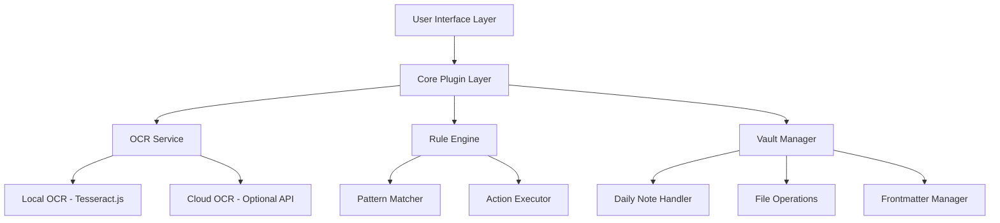
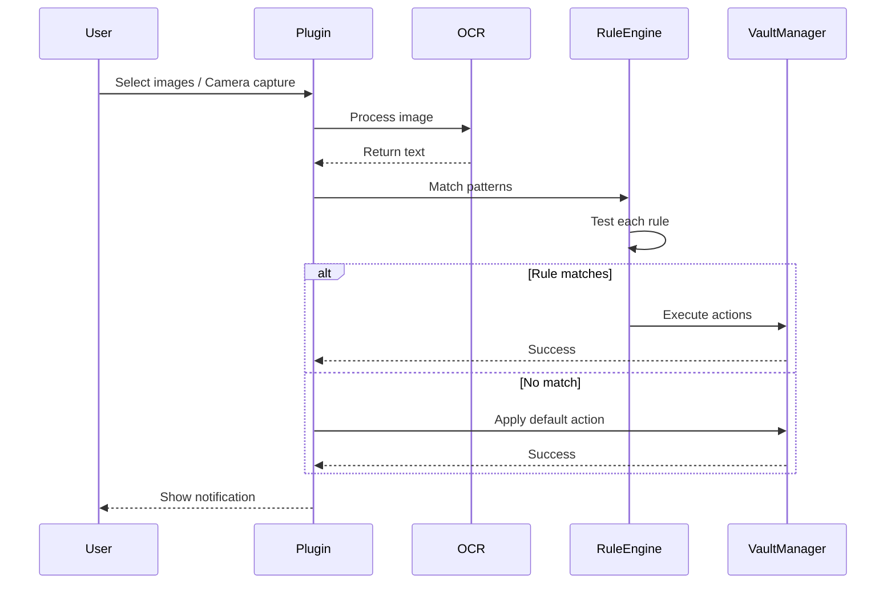
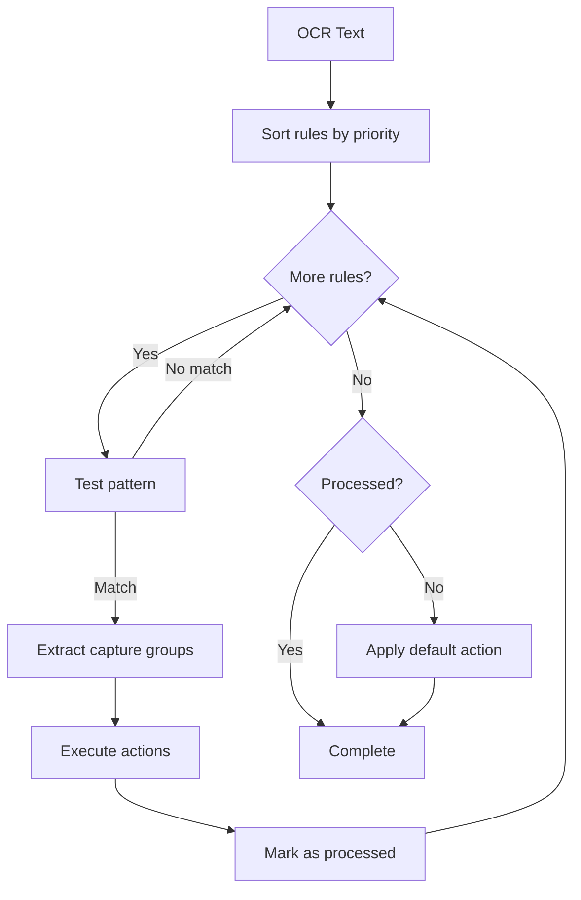

# Design Document

## Overview

The Notebook OCR Plugin is an Obsidian plugin that processes handwritten field notebook images using OCR technology and intelligently routes the extracted text based on user-configurable regex patterns and actions. The plugin architecture emphasizes flexibility through a rule-based system that allows users to define custom patterns and routing logic without code changes.

## Architecture

### High-Level Architecture



### Component Layers

1. **User Interface Layer**: Commands, settings UI, modals, file picker integration
2. **Core Plugin Layer**: Main plugin class, event coordination, state management
3. **OCR Service**: Text extraction from images with multiple backend options
4. **Rule Engine**: Pattern matching and action execution system
5. **Vault Manager**: File operations, note creation, content insertion

## Components and Interfaces

### 1. Main Plugin Class

```typescript
export default class NotebookOCRPlugin extends Plugin {
    settings: PluginSettings;
    ocrService: OCRService;
    ruleEngine: RuleEngine;
    vaultManager: VaultManager;
    folderMonitor: FolderMonitor;

    async onload(): Promise<void>;
    async onunload(): Promise<void>;
    async loadSettings(): Promise<void>;
    async saveSettings(): Promise<void>;
}
```

### 2. OCR Service

Handles image-to-text conversion with support for multiple OCR backends.

```typescript
interface OCRService {
    initialize(): Promise<void>;
    processImage(imageData: ArrayBuffer): Promise<OCRResult>;
    isAvailable(): boolean;
}

interface OCRResult {
    text: string;
    confidence: number;
    error?: string;
}

class TesseractOCRService implements OCRService {
    // Local OCR using Tesseract.js
    // Works offline, good for privacy
    // Moderate accuracy for handwriting
}

class CloudOCRService implements OCRService {
    // Optional cloud-based OCR (OpenAI Vision, Google Cloud Vision, etc.)
    // Better accuracy for handwriting
    // Requires API key and internet connection
}
```

**OCR Backend Selection**:
- **Primary**: Tesseract.js for local, offline processing
- **Optional**: Cloud API integration for improved handwriting recognition
- Settings allow users to choose backend and configure API keys

### 3. Rule Engine

Core system for pattern matching and action execution.

```typescript
interface ProcessingRule {
    id: string;
    name: string;
    enabled: boolean;
    priority: number;
    pattern: string;  // Regex pattern
    actions: RuleAction[];
}

interface RuleAction {
    type: 'create-note' | 'insert-content' | 'modify-frontmatter';
    config: ActionConfig;
}

type ActionConfig =
    | CreateNoteConfig
    | InsertContentConfig
    | ModifyFrontmatterConfig;

interface CreateNoteConfig {
    folderPath: string;
    titleTemplate: string;  // Uses capture groups: {{$1}}, {{$2}}
    frontmatter: Record<string, string>;  // Values can use {{$n}}
    bodyTemplate: string;  // Uses capture groups
}

interface InsertContentConfig {
    targetNote: string;  // Path or pattern
    insertionPoint: InsertionPoint;
    contentTemplate: string;  // Uses capture groups
}

interface InsertionPoint {
    type: 'beginning' | 'end' | 'before-pattern' | 'after-pattern' | 'under-heading';
    pattern?: string;  // For pattern-based insertion
    heading?: string;  // For heading-based insertion
}

interface ModifyFrontmatterConfig {
    targetNote: string;
    properties: Record<string, string>;  // Values can use {{$n}}
    appendToArrays: boolean;  // If true, add to existing array values
}

class RuleEngine {
    rules: ProcessingRule[];

    matchAndExecute(text: string): Promise<RuleMatch[]>;
    testPattern(pattern: string, text: string): PatternTestResult;
    validateRegex(pattern: string): ValidationResult;
}

interface RuleMatch {
    rule: ProcessingRule;
    captureGroups: string[];
    matchedText: string;
}

interface PatternTestResult {
    matched: boolean;
    captureGroups: string[];
    error?: string;
}
```

### 4. Vault Manager

Handles all file system operations within the Obsidian vault.

```typescript
class VaultManager {
    constructor(private app: App, private vault: Vault);

    // Daily Note operations
    async getDailyNote(date: Date): Promise<TFile>;
    async insertIntoDailyNote(content: string, heading?: string): Promise<void>;

    // File operations
    async createNote(
        folderPath: string,
        title: string,
        frontmatter: Record<string, any>,
        body: string
    ): Promise<TFile>;

    async insertContent(
        targetPath: string,
        content: string,
        insertionPoint: InsertionPoint
    ): Promise<void>;

    // Frontmatter operations
    async modifyFrontmatter(
        file: TFile,
        properties: Record<string, any>,
        append: boolean
    ): Promise<void>;

    // Content parsing
    findHeading(content: string, heading: string): number;
    findPattern(content: string, pattern: string): number;
}
```

### 5. Folder Monitor

Monitors a specified folder for new images and processes them automatically.

```typescript
class FolderMonitor {
    private intervalId: number;
    private processedFiles: Set<string>;

    start(folderPath: string, interval: number): void;
    stop(): void;
    async checkForNewImages(): Promise<void>;
    markAsProcessed(filePath: string): void;
}
```

### 6. Settings Manager

```typescript
interface PluginSettings {
    // OCR Settings
    ocrBackend: 'tesseract' | 'cloud';
    cloudApiKey?: string;
    cloudApiProvider?: 'openai' | 'google';

    // Daily Note Settings
    dailyNoteImportHeading: string;

    // Processing Rules
    processingRules: ProcessingRule[];

    // Default Action Settings
    defaultAction: 'daily-note' | 'discard' | 'prompt';
    noteSeparatorPattern: string;  // e.g., "^[-*]\\s"

    // Folder Monitoring
    folderMonitoringEnabled: boolean;
    monitoredFolderPath: string;
    monitoringInterval: 'hourly' | 'daily';
    moveProcessedImages: boolean;
    processedImagesFolderPath: string;

    // Mobile Settings
    enableCameraCapture: boolean;
    saveCapturesToFolder: string;
}

const DEFAULT_SETTINGS: PluginSettings = {
    ocrBackend: 'tesseract',
    dailyNoteImportHeading: '## Imported Notes',
    processingRules: [],
    defaultAction: 'daily-note',
    noteSeparatorPattern: '^[-*]\\s',
    folderMonitoringEnabled: false,
    monitoredFolderPath: 'Inbox',
    monitoringInterval: 'daily',
    moveProcessedImages: true,
    processedImagesFolderPath: 'Processed',
    enableCameraCapture: true,
    saveCapturesToFolder: 'Captures'
};
```

## Data Models

### Processing Flow



### Rule Execution Flow



## Error Handling

### OCR Errors

- **Image Load Failure**: Display error notification with file name
- **OCR Processing Failure**: Log error, offer to retry or skip
- **Low Confidence Results**: Optionally warn user if confidence < threshold

### Rule Execution Errors

- **Invalid Regex**: Validate on save, show error in settings
- **Target Note Not Found**: Log warning, optionally create or skip
- **Insertion Point Not Found**: Fall back to end of file
- **Frontmatter Parse Error**: Log error, skip frontmatter modification

### File System Errors

- **Permission Denied**: Show error notification
- **File Already Exists**: Append timestamp or number to filename
- **Folder Not Found**: Create folder automatically or show error

### Error Recovery

```typescript
interface ErrorHandler {
    handleOCRError(error: Error, imagePath: string): Promise<void>;
    handleRuleError(error: Error, rule: ProcessingRule): Promise<void>;
    handleFileSystemError(error: Error, operation: string): Promise<void>;
}
```

## Testing Strategy

### Unit Tests

- **Rule Engine**: Pattern matching, capture group extraction, template rendering
- **Vault Manager**: Content insertion logic, frontmatter parsing
- **OCR Service**: Mock OCR results, error handling
- **Template Engine**: Capture group substitution

### Integration Tests

- **End-to-End Flow**: Image selection → OCR → Rule matching → File creation
- **Rule Combinations**: Multiple rules, priority ordering
- **Daily Note Integration**: Heading creation, content insertion
- **Frontmatter Operations**: Adding tags, modifying properties

### Manual Testing

- **Mobile Compatibility**: Test on iOS and Android devices
- **Camera Integration**: Test camera capture on mobile
- **Folder Monitoring**: Verify automatic processing
- **Settings UI**: Test rule creation, pattern testing
- **Performance**: Test with multiple images, large vaults

### Test Data

- Sample handwritten notebook images (various handwriting styles)
- Pre-defined OCR text samples for rule testing
- Test vault with various note structures

## Mobile Considerations

### Platform Detection

```typescript
class PlatformHelper {
    static isMobile(): boolean {
        return Platform.isMobile;
    }

    static hasCameraAccess(): boolean {
        return Platform.isMobileApp &&
               (Platform.isIosApp || Platform.isAndroidApp);
    }
}
```

### Camera Integration

- Use Obsidian's file picker API which supports camera on mobile
- Alternative: Use Capacitor Camera API if available
- Save captured images to vault before processing
- Provide option to delete image after successful processing

### Mobile-Specific UI

- Simplified settings interface for mobile
- Touch-friendly rule management
- Quick action buttons for common operations

## Performance Optimization

### OCR Processing

- Process images asynchronously to avoid blocking UI
- Show progress indicator for long operations
- Option to process multiple images in parallel (configurable)
- Cache OCR results to avoid reprocessing

### Rule Matching

- Compile regex patterns once and cache
- Short-circuit evaluation (stop after first match if configured)
- Optimize pattern order by priority

### File Operations

- Batch file operations when possible
- Use cached reads for metadata operations
- Debounce folder monitoring checks

## Security and Privacy

### Data Handling

- All OCR processing happens locally by default (Tesseract.js)
- Cloud OCR is opt-in with explicit API key configuration
- No data sent to external services without user consent
- API keys stored securely in Obsidian's data storage

### File Access

- Only access files within the Obsidian vault
- Respect Obsidian's file system permissions
- No external file system access

## Configuration UI

### Settings Tab Structure

1. **OCR Settings**
   - Backend selection (Local/Cloud)
   - API configuration (if cloud selected)
   - Language selection for Tesseract

2. **Processing Rules**
   - List of rules with enable/disable toggles
   - Add/Edit/Delete rule buttons
   - Drag to reorder (priority)
   - Pattern tester interface

3. **Default Actions**
   - Daily note heading configuration
   - Note separator pattern
   - Fallback action selection

4. **Folder Monitoring**
   - Enable/disable toggle
   - Folder path selection
   - Interval configuration
   - Processed files handling

5. **Mobile Settings**
   - Camera capture enable/disable
   - Capture save location

### Rule Editor Modal

```typescript
class RuleEditorModal extends Modal {
    rule: ProcessingRule;

    onOpen(): void {
        // Display:
        // - Rule name input
        // - Regex pattern input with syntax highlighting
        // - Pattern tester (input text, show matches)
        // - Action configuration section
        // - Add action button
        // - Save/Cancel buttons
    }
}
```

### Pattern Tester Interface

- Text area for sample input
- Real-time pattern matching
- Display of capture groups
- Preview of action output with sample data
- Regex syntax help/reference

## Dependencies

### Required NPM Packages

```json
{
  "dependencies": {
    "obsidian": "latest",
    "tesseract.js": "^4.0.0"
  },
  "devDependencies": {
    "@types/node": "^16.11.6",
    "typescript": "4.4.4",
    "esbuild": "0.13.12"
  }
}
```

### Optional Dependencies

- OpenAI SDK (for cloud OCR)
- Google Cloud Vision SDK (for cloud OCR)

## Deployment Considerations

### Plugin Distribution

- Package as standard Obsidian plugin
- Include manifest.json with required Obsidian version
- Provide clear installation instructions
- Document OCR backend options and trade-offs

### Initial Setup

- First-run wizard to configure basic settings
- Sample rules for common patterns
- Link to documentation and examples

### Updates and Migrations

- Version settings schema
- Provide migration path for settings changes
- Backward compatibility for rule format

## Future Enhancements

### Potential Features

- Batch processing UI with progress tracking
- Rule templates/presets for common use cases
- OCR result editing before processing
- Image preprocessing (rotation, contrast adjustment)
- Support for PDF files
- Integration with Obsidian's daily note plugins
- Export/import rule configurations
- Rule statistics and usage tracking
- AI-powered pattern suggestion based on OCR results
